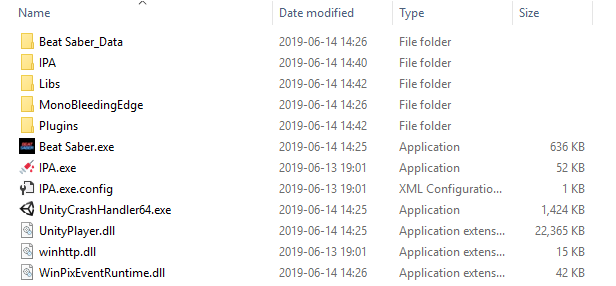

# Installing BSIPA

> [!NOTE]
> This guide assumes that you are starting completely fresh.

 1. Grab a release from the GitHub [Releases page](https://github.com/beat-saber-modding-group/BeatSaber-IPA-Reloaded/releases).
    Make sure to download `BSIPA.zip`, as `ModList.zip` contains the Beat Saber mod for showing your mods in-game, not the loader itself.

 2. Extract the zip into your game installation directory. There should now be a folder named `IPA` and a file named `IPA.exe` in
    the same folder as the game executable.

    For example, if you are installing BSIPA in Beat Saber, it might look like this after extraction:

    

 3. Run `IPA.exe` by double clicking it. A console window should pop up, and eventually, a gold message asking you to press a key
    will appear. Here is an example of a successful installation:

    

    > [!NOTE]
    > In some cases, this may fail, something like this: 
    >
    > In these cases, try dragging the game executable over `IPA.exe`.

    After installing, your game directory should look something like this:
    

    > [!NOTE]
    > At this point it is recommended to run the game once before continuing, to ensure that things are installed correctly.
    >
    > The first run should create a `UserData` folder with `Beat Saber IPA.json` and `Disabled Mods.json`, as well as a
    > `Logs` folder with several subfolders with their own files. If these are created, then the installation was very
    > likely successful.
    >
    > [!TIP]
    > If you are not installing BSIPA on Beat Saber, you probably want to go to the config at `UserData/Beat Saber IPA.json`
    > and set both of the following to `false`:
    >
    > ```json
    > {
    >   ...
    >   "Updates": {
    >     "AutoUpdate": false,
    >     "AutoCheckUpdates": false
    >   },
    >   ...
    > }
    > ```

 4. From here, just place all of your plugins in the `Plugins` folder, and you're all set!

    Many plugins will come in a zip such that the root of the zip represents the game install directory, so all you may have to
    do is extract the plugin into the game installation folder.

Thats really all you have to do! The installation should persist across game updates for as long as `winhttp.dll` is present in
the game directory, though your plugins will be moved to a different folder when it does update so things don't break horribly.
